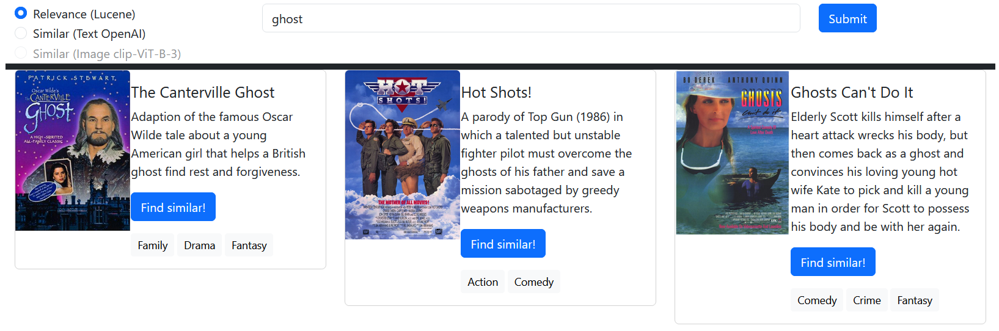
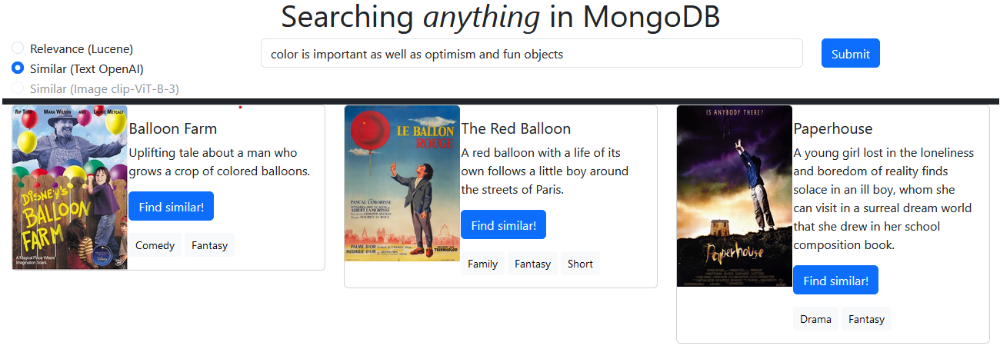
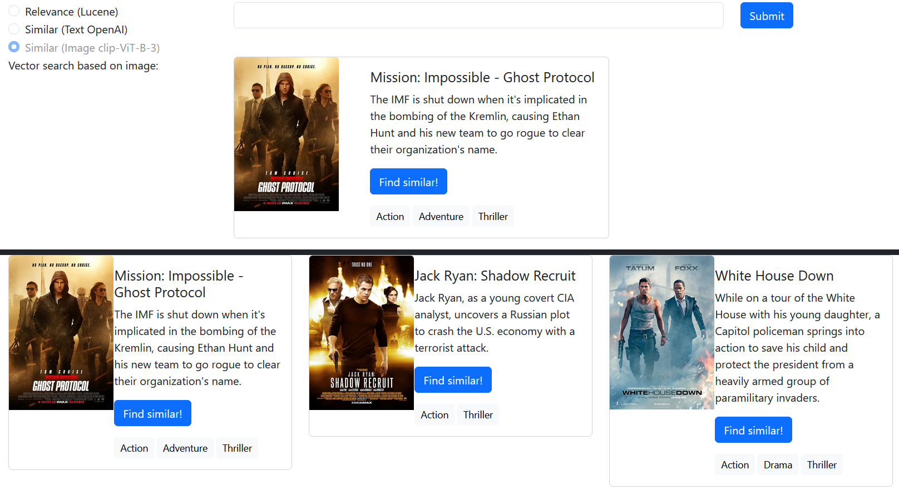
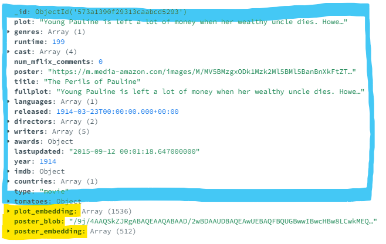

# Database search, Relevance search, Semantic embeddings search with MongoDB

TL;DR: A hacked together web app with a MongoDB Atlas backend using different search queries.

[Skip to the live demo'](http://mdb-search-lb-1487448759.eu-west-3.elb.amazonaws.com/) (Username and password are in the .env.example, to avoid bots)

## Introduction

Offering a great user Search experience in applications can be difficult, but does not need to be.

This application combines several search techniques available in MongoDB on an operational dataset of movies. MongoDB is a very popular document database known for its powerful transactional and analytical capabilities on structured and semi-structured data in a JSON-like structure. The addition of relevance search and semantic vector search in the same platform and query language is very easy and simple to use, without much complexity. As a vector database, it now also stores unstructured data such as text, images, or audio, in vector embeddings (high-dimensional vectors) to make it easy to find and retrieve similar objects quickly. 

- transactional database search (`MongoDB`),
- relevance search with MongoDB Atlas Search (`Lucene`),
- semantic search with MongoDB Atlas Vector Search based on embeddings for text (`text-embedding-ada-002`),
- semantic search with MongoDB Atlas Vector Search based on embeddings for images (`clip-ViT-B-32`),

Atlas Search allows relevance search and scoring capabilities based on open-source Lucene indexes. Here, I use it to search relevant movies with language support and typo correction.

Each movie's text plot is ran through OpenAI's embedding API and those `text-embedding-ada-002` embeddings are stored in MongoDB. The user's prompt is embedded and used to query in the vector database for similar content. You can search either on your input, or do a similarity search based on an existing movie's plot.

Each movie's poster image is interpreted by `clip-ViT-B-32`. Those picture embeddings are stored in MongoDB. The user can find movies with poster images that are similar to their query.

The document structure looks as follows. In blue you have the fields, nested objects and arrays with operational data. The blue are queried with database search and Atlas Search relevance search. This projects adds the fields in yellow: a base64 representation of the movie poster, ada OpenAI text embeddings and clip image embeddings, queried with Atlas Vector Search.

## Set-up environment

You need `python3` and `pip`.

    python3 --version
    python3 -m ensurepip --upgrade
    pip3 install -r requirements.txt

You need a `MongoDB Atlas` cluster. This can be a free cluster, created on [cloud.mongodb.com](https://www.mongodb.com/atlas/database). Ensure database access and network access allow you to make a connection to the database. Note free clusters have a size and performance limitation, feel free to run this on a small paid cluster with lots more data.

You need to set some local environment variables, this can be local `.env` file

    MDB_CONN=<YOUR MongoDB Atlas connection string>
    DB="sample_mflix"
    COLL="embedded_movies"
    OPENAI_API_KEY=<YOUR OpenAI API key>
    SITE_USER=<a preferred username to log in with>
    SITE_PASS=<a preferred password to log in with>

## Preparing the data

Clone the [mdb-search-data repo](https://github.com/dvsander/mdb-search-data).

In there you are offered 2 options: restoring from backup or generating the embeddings yourself locally.

## Enabling the relevance search and vector search in MongoDB Atlas

In Atlas, in the cluster view `Search tab`, enter the following JSON configuration. Use the `default` index name and ensure to create it on the `embedded_movies` collection. This is the magic that will enable dynamic full text search on fields, as well as enable the vector search indexes. No data copy needed :o 

    {
        "mappings": {
            "dynamic": true,
            "fields": {
                "plot_embedding": {
                    "dimensions": 1536,
                    "similarity": "cosine",
                    "type": "knnVector"
                },
                "poster_embedding": {
                    "dimensions": 512,
                    "similarity": "cosine",
                    "type": "knnVector"
                }
            }
        }
    }

## Time to run it

This is a Flask Python3 web-app.

Start the Flask app like this

    flask --app app run

Or with a helper just use python like this

    python app.py

You can access the web app at `http://localhost:5000`.

You can now:

- use the full text search from the input field to find 'any' random set of movies with relevance search
- use the OpenAI text embeddings dearch to find movies similar to the text sentiment you enter, sounds exotic!
- click the button on one of the movies and see 'similar movie posters', see what happens :)

Trust the ML and the embedding model. Can you guess why these pictures are similar?
